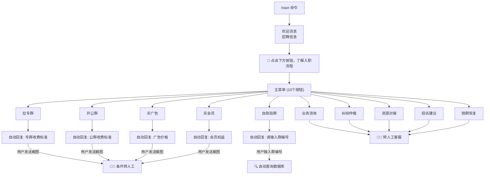

# 土豆担保机器人 - 完整需求文档

## 一、项目概述

### 1.1 机器人信息
| 项目 | 内容 |
|------|------|
| **名称** | 土豆担保 |
| **用户名** | @tddbo4bot |
| **月活用户** | 136,616 位用户 |
| **主要用途** | 担保交易服务、群管理、广告发布、会员服务 |
| **目标用户** | 需要担保交易的商家、广告主、群主 |

### 1.2 核心功能
- 担保交易服务（专群/公群）
- 人员招聘管理
- 广告发布服务
- 会员体系
- 群验证与管理
- 人工客服对接

---

## 二、技术架构分析

### 2.1 为什么使用 Inline Keyboard

| 特性 | Inline Keyboard | Reply Keyboard | 纯文本命令 |
|------|----------------|----------------|------------|
| **用户体验** | ⭐⭐⭐⭐⭐ 按钮嵌入消息，交互直观 | ⭐⭐⭐ 键盘替换输入法 | ⭐⭐ 需要记忆命令 |
| **状态管理** | ⭐⭐⭐⭐⭐ callback_data 携带状态 | ⭐⭐ 无状态 | ⭐⭐ 需解析文本 |
| **多级菜单** | ⭐⭐⭐⭐⭐ 原生支持嵌套 | ⭐⭐ 难以实现 | ⭐ 需复杂逻辑 |
| **消息整洁** | ⭐⭐⭐⭐⭐ 按钮附着在消息上 | ⭐⭐⭐ 占用屏幕空间 | ⭐⭐⭐⭐ 无额外元素 |
| **可追溯性** | ⭐⭐⭐⭐⭐ 历史消息按钮可点击 | ⭐⭐ 键盘会被替换 | ⭐⭐⭐ 需重新输入 |

**结论**: Inline Keyboard 最适合土豆担保这类多功能、多层级的业务场景。

### 2.2 消息流转原理

```
用户操作                    Telegram API                    机器人后端
   │                            │                              │
   │  点击 Inline Button        │                              │
   ├───────────────────────────>│                              │
   │                            │  CallbackQuery               │
   │                            ├─────────────────────────────>│
   │                            │                              │
   │                            │  answerCallbackQuery         │
   │                            │<─────────────────────────────┤
   │                            │                              │
   │                            │  sendMessage / editMessage   │
   │                            │<─────────────────────────────┤
   │  显示新消息/按钮            │                              │
   │<───────────────────────────┤                              │
```

### 2.3 Callback Data 设计

```python
# callback_data 格式: "action:parameter"
# 示例:
"menu:main"           # 返回主菜单
"service:la_zhuan"    # 拉专群
"service:kai_gong"    # 开公群
"service:zixun"       # 业务咨询
"verify:input"        # 自助验群-等待输入
"contact:kefu"        # 联系客服
```

---

## 三、功能架构图



---

## 四、完整功能列表

### 4.1 入口层级

| 层级 | 触发方式 | 响应内容 |
|------|----------|----------|
| L0 | `/start` 命令 | 欢迎消息 + 招聘信息 + 入口按钮 |
| L1 | 点击"了解入职流程" | 主菜单（10个 Inline 按钮） |
| L2 | 点击具体功能按钮 | 功能详情 + 子按钮/转人工 |

### 4.2 /start 欢迎消息

```
土豆担保华人线上招聘正式开启

1️⃣ 公群广告删除员
薪资：白班200U/天，夜班300U/天
押金：1500U
工作内容：公群内删除广告，有广告老板会@您因为老板没有删除权限，每个账号20个群，工作量适中

2️⃣ 专群消息删除员
薪资：白班500U/天，夜班800U/天
押金：5000U
工作内容：客户交易完成之后，将专群内容全部删除，恢复成新群，管理一个帐号，每个账号100个群，工作量不大

应聘人员要求：👇
语言要求：中文
准备设备：手机/电脑任意一台可使用飞机即可
工资问题：日结，下班组长统一报备财务结算（3个小时内到账）
工作地点：线上居家办公
工作时间：每天6小时 可选
白班（早上6-中午12）（中午12-晚上6）
夜班（晚上6-凌晨12）（凌晨12-早上6）

👇👇 点击下方按钮了解入职流程
```

**入口按钮:**
```
[🔘 点击下方按钮，了解入职流程]
```

### 4.3 主菜单按钮 (10个)

| 序号 | 按钮名称 | callback_data | 响应类型 |
|------|----------|---------------|----------|
| 1 | 拉专群 | `service:la_zhuan` | 自动回复 → 条件转人工 |
| 2 | 开公群 | `service:kai_gong` | 自动回复 → 条件转人工 |
| 3 | 业务咨询 | `service:zixun` | 直接转人工 |
| 4 | 纠纷仲裁 | `service:jiufen` | 直接转人工 |
| 5 | 买广告 | `service:guanggao` | 自动回复 → 条件转人工 |
| 6 | 买会员 | `service:huiyuan` | 自动回复 → 条件转人工 |
| 7 | 资源对接 | `service:ziyuan` | 直接转人工 |
| 8 | 投诉建议 | `service:tousu` | 直接转人工 |
| 9 | 自助验群 | `service:yanqun` | 全自动 |
| 10 | 销群恢复 | `service:xiaoqhf` | 直接转人工 |

**按钮布局 (2列 x 5行):**
```
┌─────────────┬─────────────┐
│   拉专群    │   开公群    │
├─────────────┼─────────────┤
│  业务咨询   │  纠纷仲裁   │
├─────────────┼─────────────┤
│   买广告    │   买会员    │
├─────────────┼─────────────┤
│  资源对接   │  投诉建议   │
├─────────────┼─────────────┤
│  自助验群   │  销群恢复   │
└─────────────┴─────────────┘
```

---

## 五、交互流程设计

### 5.1 拉专群

**触发:** 点击"拉专群"按钮

**响应消息:**
```
专群收费标准

1、美金买卖USDT和换汇：佣金为成交价0.2%（最低20美金/20U起），付佣方由买卖双方商议决定；

2、代付代收交易：
收费模式200u包月模式；
收费模式按天收费模式：当天有交易收15u，当天没交易不收佣金，为了避免群被无效占用，每连续三天没有交易也收15u佣金。（代收代付，交易最低押金800U起，一个上下押周期保底佣金20u。

3、普通商品交易：佣金为成交价3%（最低20美金/20U起），付佣方由买卖双方商议决定；
```

**后续消息:**
```
因正在接受好旺资源，群资源紧张，防止恶意拉群，上押后给您拉群

如双押，您这边上押后，我方拉群，另一位老板在进群上押

如没有交易成功可以免手续费退押

TRC20地址： （点击地址自动复制）

TWkdsUoYixY3N1RfHLUP2zqtT1uf7nUDPU

上押完成后截图发我们，我们会优先分配组长接待您，没有上押这边不会回复哦
```

**按钮:**
```
[📋 复制地址] [👨‍💼 联系客服] [🔙 返回菜单]
```

### 5.2 开公群

**触发:** 点击"开公群"按钮

**响应消息:**
```
【公群收费标准】

公群推广费200U，下押关群，以下为各类型公群收费标准

第一类：
1、代收/承兑/群内跑分/银行卡套现/卡密核销/聚合码
上押15000U起，月费500U；
注：公群做收现业务需加押5000U封存，不能做为交易金额；
2、APP后台跑分
上押50000U，月费900U，群内需老板每日提供后台数据；
3、VIP小公群
① 金流类，月费300U；
② 非金流类，月费200u
4、汇旺美金/汇旺U/ABA互换
上押20000U，月费500U

第二类：
1、解封银行卡工商9920/解封交易所支付宝/POS机出售
上押15000u，月费200u,交易佣金3%；
2、搭建类/代办公户/三方、四方进件
上押15000u，月费500u,佣金3%；
3、卡商中介群
上押15000U，月费900U；
```

### 5.3 业务咨询 / 纠纷仲裁

**触发:** 点击"业务咨询"或"纠纷仲裁"按钮

**响应消息:**
```
你好，土豆担保人工客服，请问有什么可以帮助您？
```

**系统行为:** 通知人工客服接入

### 5.4 买广告

**触发:** 点击"买广告"按钮

**响应消息:**
```
土豆供需广告限时福利来了：

收费标准：
普通广告200U一条，包周1200U，包月4400U。
公群广告100U一条，包周600U，包月2200U。
周置顶800U，月置顶3000U。

单条限时优惠福利
普通广告买10条送10条 共20条 需支付2000U
公群广告买10条送20条 共30条 需支付1000U

TRC20地址：（点击地址自动复制）

TWkdsUoYixY3N1RfHLUP2zqtT1uf7nUDPU

因购买人数较多，请您支付完成带截图点击下方按钮联系专属客服登记，没有付款客服不会回复哦
```

### 5.5 买会员

**触发:** 点击"买会员"按钮

**响应消息:**
```
我们创建了高级用户交流群，现邀请各行业大佬加入：

高级用户群内客户可享专属工作人员对接，获取各类资源推荐，帮您对接高质量交易方，可以更快更有效地拓展您的业务。

群内专属客服高效服务，随时为您解决问题！之外还可以享受以下特殊福利

优先安排接手退押老群的权利
可以免费对接各种资源

高级用户拉专群交易，优先处理群内交易。

群内如有客户有纠纷，拉群，开公群等业务需要，高级专属客服第一时间对接到位。

高级群客户，每周赠送一条供需广告。

群内现有大量盘口负责人等待对接车队，如果您是车队，不要错过哦

限时免费进群，需上押888U一位 888U可在专群或者公群买卖或者交易使用掉，不可退押

TRC20地址：（点击地址自动复制)
TWkdsUoYixY3N1RfHLUP2zqtT1uf7nUDPU

因申请人数太多，请您直接支付然后截图发给我们，人工客服会优先接待您。
```

### 5.6 资源对接

**触发:** 点击"资源对接"按钮

**响应消息:**
```
您好，这里是资源对接板块，请问你是主做什么业务，需要找什么类型的资源。
```

**系统行为:** 通知人工客服接入

### 5.7 投诉建议

**触发:** 点击"投诉建议"按钮

**响应消息:**
```
您好，这里是土豆担保工作人员投诉通道，投诉哪位工作人员，请将您需要投诉的问题描述清楚。
```

**系统行为:** 通知人工客服接入

### 5.8 自助验群

**触发:** 点击"自助验群"按钮

**响应消息:**
```
请输入您需要验证的群编号，如"专群A12345""公群12345""飞博13"
```

**系统行为:**
1. 设置用户状态为 `waiting_group_id`
2. 等待用户输入群编号
3. 查询数据库验证
4. 返回验证结果

### 5.9 销群恢复

**触发:** 点击"销群恢复"按钮

**响应消息:**
```
您是负责人或者公群老板吗？请准备好原上押地址，并且提供群编号哦。
```

**系统行为:** 通知人工客服接入


---

## 六、人工客服接入规则

### 6.1 接入方式分类

| 类型 | 按钮 | 触发条件 | 优先级 |
|------|------|----------|--------|
| **立即转人工** | 业务咨询、纠纷仲裁、资源对接、投诉建议、销群恢复 | 点击按钮即触发 | 高 |
| **条件转人工** | 拉专群、开公群、买广告、买会员 | 用户发送图片/截图 | 中 |
| **全自动** | 自助验群 | 无需人工 | - |

### 6.2 人工客服触发关键词

```python
HUMAN_TRIGGER_KEYWORDS = [
    "人工客服",
    "请问有什么可以帮助您",
    "请问你是主做什么业务",
    "投诉通道",
    "请将您需要投诉的问题描述清楚",
    "请准备好原上押地址"
]
```

### 6.3 图片检测转人工

```python
async def handle_photo(update: Update, context: ContextTypes.DEFAULT_TYPE):
    user_state = get_user_state(update.effective_user.id)

    # 如果用户在等待上押截图的状态
    if user_state in ["waiting_deposit_la", "waiting_deposit_kai",
                       "waiting_deposit_gg", "waiting_deposit_hy"]:
        # 通知人工客服
        await notify_human_agent(update, context)
        await update.message.reply_text(
            "已收到您的截图，人工客服会优先接待您，请稍候..."
        )
```

---

## 七、数据存储需求

### 7.1 用户表 (users)

| 字段 | 类型 | 说明 |
|------|------|------|
| user_id | BIGINT | Telegram 用户 ID (主键) |
| username | VARCHAR(100) | 用户名 |
| first_name | VARCHAR(100) | 名字 |
| state | VARCHAR(50) | 当前状态 |
| created_at | TIMESTAMP | 首次使用时间 |
| last_active | TIMESTAMP | 最后活动时间 |

### 7.2 群信息表 (groups)

| 字段 | 类型 | 说明 |
|------|------|------|
| group_id | VARCHAR(50) | 群编号 (主键) |
| group_type | ENUM | 专群/公群/飞博 |
| owner_user_id | BIGINT | 群主用户 ID |
| deposit_address | VARCHAR(100) | 上押地址 |
| deposit_amount | DECIMAL | 押金金额 |
| monthly_fee | DECIMAL | 月费 |
| status | ENUM | active/closed/suspended |
| created_at | TIMESTAMP | 创建时间 |

### 7.3 交易记录表 (transactions)

| 字段 | 类型 | 说明 |
|------|------|------|
| tx_id | INT AUTO_INCREMENT | 交易 ID (主键) |
| user_id | BIGINT | 用户 ID |
| tx_type | ENUM | deposit/withdraw/fee |
| amount | DECIMAL | 金额 |
| address | VARCHAR(100) | 区块链地址 |
| tx_hash | VARCHAR(100) | 交易哈希 |
| status | ENUM | pending/confirmed/failed |
| created_at | TIMESTAMP | 创建时间 |

### 7.4 客服会话表 (support_sessions)

| 字段 | 类型 | 说明 |
|------|------|------|
| session_id | INT AUTO_INCREMENT | 会话 ID (主键) |
| user_id | BIGINT | 用户 ID |
| agent_id | BIGINT | 客服 ID |
| service_type | VARCHAR(50) | 服务类型 |
| status | ENUM | waiting/active/closed |
| created_at | TIMESTAMP | 创建时间 |
| closed_at | TIMESTAMP | 结束时间 |

---

## 八、技术选型

### 8.1 推荐技术栈

| 组件 | 选择 | 理由 |
|------|------|------|
| **语言** | Python 3.10+ | 生态丰富，开发效率高 |
| **Bot 框架** | python-telegram-bot v20+ | 官方推荐，支持异步，文档完善 |
| **数据库** | PostgreSQL / MySQL | 关系型数据库，适合交易记录 |
| **缓存** | Redis | 用户状态缓存，提高响应速度 |
| **部署** | Docker + Nginx | 容器化部署，易于维护 |

### 8.2 python-telegram-bot 核心代码示例

#### 8.2.1 Inline Keyboard 创建

```python
from telegram import InlineKeyboardButton, InlineKeyboardMarkup

def get_main_menu_keyboard():
    """主菜单键盘"""
    keyboard = [
        [
            InlineKeyboardButton("拉专群", callback_data="service:la_zhuan"),
            InlineKeyboardButton("开公群", callback_data="service:kai_gong"),
        ],
        [
            InlineKeyboardButton("业务咨询", callback_data="service:zixun"),
            InlineKeyboardButton("纠纷仲裁", callback_data="service:jiufen"),
        ],
        [
            InlineKeyboardButton("买广告", callback_data="service:guanggao"),
            InlineKeyboardButton("买会员", callback_data="service:huiyuan"),
        ],
        [
            InlineKeyboardButton("资源对接", callback_data="service:ziyuan"),
            InlineKeyboardButton("投诉建议", callback_data="service:tousu"),
        ],
        [
            InlineKeyboardButton("自助验群", callback_data="service:yanqun"),
            InlineKeyboardButton("销群恢复", callback_data="service:xiaoqhf"),
        ],
    ]
    return InlineKeyboardMarkup(keyboard)
```

#### 8.2.2 /start 命令处理

```python
async def start_command(update: Update, context: ContextTypes.DEFAULT_TYPE):
    """处理 /start 命令"""
    welcome_text = """土豆担保华人线上招聘正式开启

1️⃣ 公群广告删除员
薪资：白班200U/天，夜班300U/天
押金：1500U
...

👇👇 点击下方按钮了解入职流程"""

    keyboard = [[
        InlineKeyboardButton("🔘 点击下方按钮，了解入职流程", callback_data="menu:main")
    ]]
    reply_markup = InlineKeyboardMarkup(keyboard)

    await update.message.reply_text(welcome_text, reply_markup=reply_markup)
```

#### 8.2.3 Callback Query 处理

```python
async def button_callback(update: Update, context: ContextTypes.DEFAULT_TYPE):
    """处理按钮回调"""
    query = update.callback_query
    await query.answer()  # 必须应答，否则按钮会一直 loading

    data = query.data
    action, param = data.split(":")

    if action == "menu":
        if param == "main":
            await query.message.reply_text(
                "请选择您需要的服务：",
                reply_markup=get_main_menu_keyboard()
            )

    elif action == "service":
        await handle_service(query, param)
```

### 8.3 项目结构

```
telegram_bot/
├── bot/
│   ├── __init__.py
│   ├── main.py              # 入口文件
│   ├── handlers/
│   │   ├── __init__.py
│   │   ├── start.py         # /start 命令
│   │   ├── callbacks.py     # 按钮回调
│   │   ├── messages.py      # 文本消息处理
│   │   └── photos.py        # 图片处理
│   ├── keyboards/
│   │   ├── __init__.py
│   │   └── inline.py        # Inline 键盘定义
│   ├── services/
│   │   ├── __init__.py
│   │   ├── user_state.py    # 用户状态管理
│   │   ├── group_verify.py  # 群验证服务
│   │   └── human_agent.py   # 人工客服通知
│   ├── database/
│   │   ├── __init__.py
│   │   ├── models.py        # 数据模型
│   │   └── crud.py          # 数据库操作
│   └── config.py            # 配置文件
├── requirements.txt
├── Dockerfile
└── docker-compose.yml
```

---

## 九、为什么采用这种架构

### 9.1 Inline Keyboard 的优势

1. **用户体验优秀**
   - 按钮直接嵌入消息，用户无需记忆命令
   - 历史消息中的按钮仍可点击
   - 支持多层级菜单，交互清晰

2. **状态管理简单**
   - callback_data 可携带业务参数
   - 无需解析用户自然语言输入
   - 减少输入错误

3. **消息可追溯**
   - 每个操作都有对应的消息记录
   - 用户可随时返回上一级菜单
   - 客服可查看完整交互历史

### 9.2 人工客服混合模式的优势

1. **降低人工成本**
   - 简单查询（如验群）全自动处理
   - 复杂业务才转人工

2. **提高响应速度**
   - 自动回复秒级响应
   - 人工客服处理有价值的咨询

3. **条件触发机制**
   - 用户付款后才转人工，过滤无效咨询
   - "没有上押这边不会回复哦" 明确告知用户规则

---

## 十、开发计划

| 阶段 | 内容 | 时间 |
|------|------|------|
| **P1** | 基础框架 + /start + 主菜单 | 1天 |
| **P2** | 10个功能按钮的自动回复 | 1天 |
| **P3** | 用户状态管理 + 自助验群 | 1天 |
| **P4** | 图片检测 + 人工客服通知 | 1天 |
| **P5** | 数据库集成 + 后台管理 | 2天 |
| **P6** | 测试 + 部署 | 1天 |

**总计: 约 7 个工作日**

